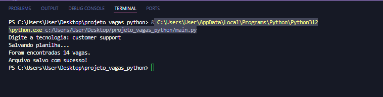
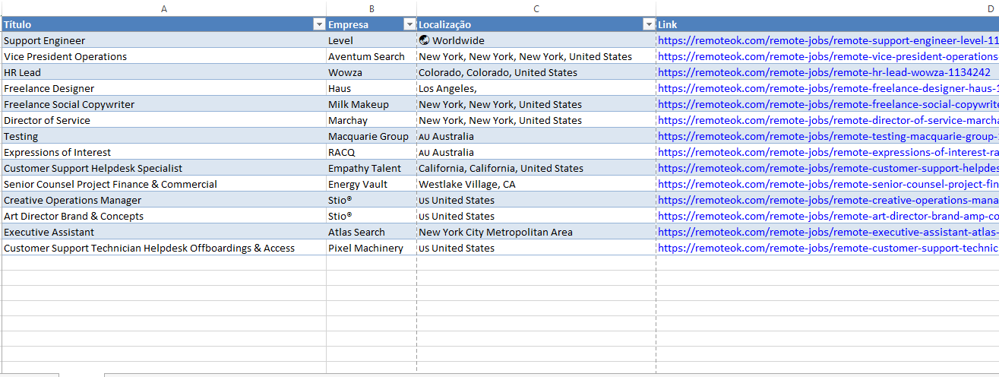
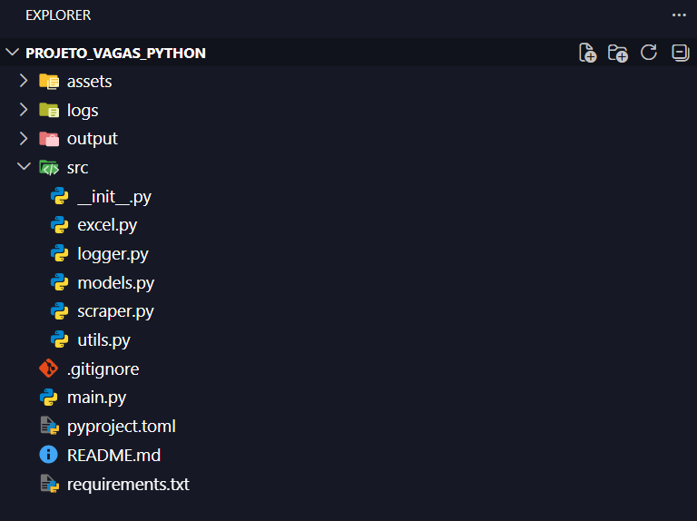

# 🚀 Extrator de Vagas RemoteOK

Aplicação desenvolvida em Python para realizar web scraping no site RemoteOK, permitindo pesquisar vagas por tecnologia e exportar os resultados para uma planilha Excel profissional.

---

## ✨ Funcionalidades

- 🔎 Pesquisa de vagas por tecnologia.
- 🌐 Coleta automática de vagas do RemoteOK.
- 📄 Exportação para Excel (.xlsx).
- 🔗 Links clicáveis para as vagas.
- 📊 Tabela formatada automaticamente.
- 📝 Sistema de logs.
- ⚠️ Tratamento de exceções.
- 🏗️ Arquitetura modular.

---

## 🛠️ Tecnologias Utilizadas

- Python 3.12
- Playwright
- OpenPyXL
- Dataclasses
- Logging

---

## 📸 Demonstração

### Terminal



### Planilha Gerada



### Estrutura no VS Code



---

## ⚙️ Instalação

Clone o repositório:

```bash
git clone https://github.com/SEU-USUARIO/projeto_vagas_python.git
```

Entre na pasta:

```bash
cd projeto_vagas_python
```

Instale as dependências:

```bash
pip install -r requirements.txt
```

Instale os navegadores do Playwright:

```bash
playwright install

```
## ▶️ Como Executar


Execute o projeto:

```bash
python main.py
```

Digite a tecnologia desejada:

```text
Digite a tecnologia: Python
```

O programa irá:

1. Pesquisar as vagas no RemoteOK.
2. Filtrar pela tecnologia informada.
3. Gerar uma planilha Excel em:

```text
output/
```

## 👨‍💻 Autor

Desenvolvido por **João Kennedy Gama**.

Atualmente em transição de carreira para a área de tecnologia, estudando:

- Python
- Automação
- Web Scraping
- Análise de Dados
- Desenvolvimento de Projetos

### Contato

- LinkedIn: https://www.linkedin.com/in/joão-kennedy-gama

- GitHub: https://github.com/kennedyGama7

## 📝 Licença

Este projeto foi desenvolvido para fins de estudo e construção de portfólio.